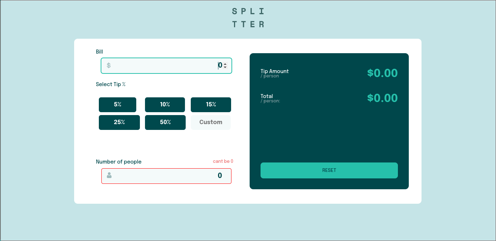

# Frontend Mentor - Tip calculator app solution

This is a solution to the [Tip calculator app challenge on Frontend Mentor](https://www.frontendmentor.io/challenges/tip-calculator-app-ugJNGbJUX). Frontend Mentor challenges help you improve your coding skills by building realistic projects.

## Table of contents

- [Overview](#overview)
  - [The challenge](#the-challenge)
  - [Screenshot](#screenshot)
  - [Links](#links)
- [My process](#my-process)
  - [Built with](#built-with)
  - [What I learned](#what-i-learned)
- [Author](#author)
- [Acknowledgments](#acknowledgments)

## Overview

### The challenge

Users should be able to:

- View the optimal layout for the app depending on their device's screen size
- See hover states for all interactive elements on the page
- Calculate the correct tip and total cost of the bill per person

### Screenshot

### Links

- Solution URL: [code github](https://github.com/time9683/tip-calculator)
- Live Site URL: [live site](https://tip-calculator-tau-seven.vercel.app/)

## My process

### Built with

- Semantic HTML5 markup
- CSS custom properties
- Flexbox
- CSS Grid
- Mobile-first workflow
- [Svelte](https://svelte.dev/)  
- [Sveltekit](https://kit.svelte.dev/) - framework

**Note: These are just examples. Delete this note and replace the list above with your own choices**

### What I learned
I learned how to use svelte and manage state with store

## Author

- Frontend Mentor - [@time9683](https://www.frontendmentor.io/profile/time9683)
- Github - [@time9683](https://github.com/time9683)

